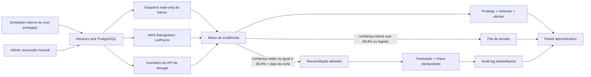

# Arquitetura de integridade

O lock impede auditorias simultâneas. O snapshot do banco usa transação `REPEATABLE READ READ ONLY`. A reconciliação abre uma transação separada, relê o alvo com bloqueio e só executa operações da allowlist. O pipeline facial validado não importa nem chama este serviço.

## Fronteiras

- Entrada: scheduler, cron autenticado ou administrador autenticado.
- Dependências somente leitura: produtos, eventos, fotógrafos, `photo_faces`, AWS `ListFaces` e inventário do storage.
- Escritas próprias: tabelas `integrity_*`.
- Escritas reconciliadoras limitadas: `photo_faces.photographer_id` vazio e inserção idempotente de `photo_faces` a partir de FaceIds existentes.
- Proibido: `IndexFaces`, `DeleteFaces`, mudanças em produto, evento, upload, threshold ou pipeline.
